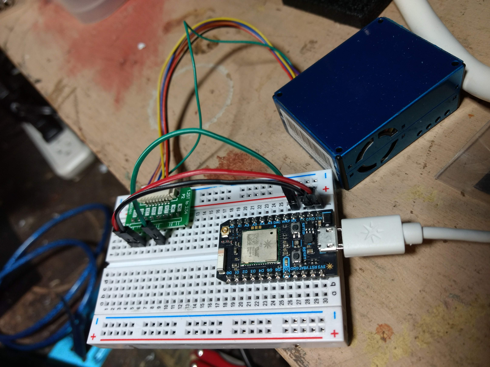

# Dust Sensor (PMS5003)

This air quality sensor measures PM2.5 dust concentration. It can be used in combination with the Particle Photon to store data and send a notification when poor quality air is detected.

## Parts

- [Dust Sensor](https://www.adafruit.com/product/3686)
- [Particle Photon](https://www.adafruit.com/product/2721)
- [Wires](https://www.adafruit.com/product/758)

## Hookup

- VCC: The PMS5003 sensor requires 5v to power the fan. Plug it into VIN on the Particle Photon to get the 5v.
- TX: (transmit) on the PMS5003 should be connected to RX (receive) on the Photon
- GND: GND
